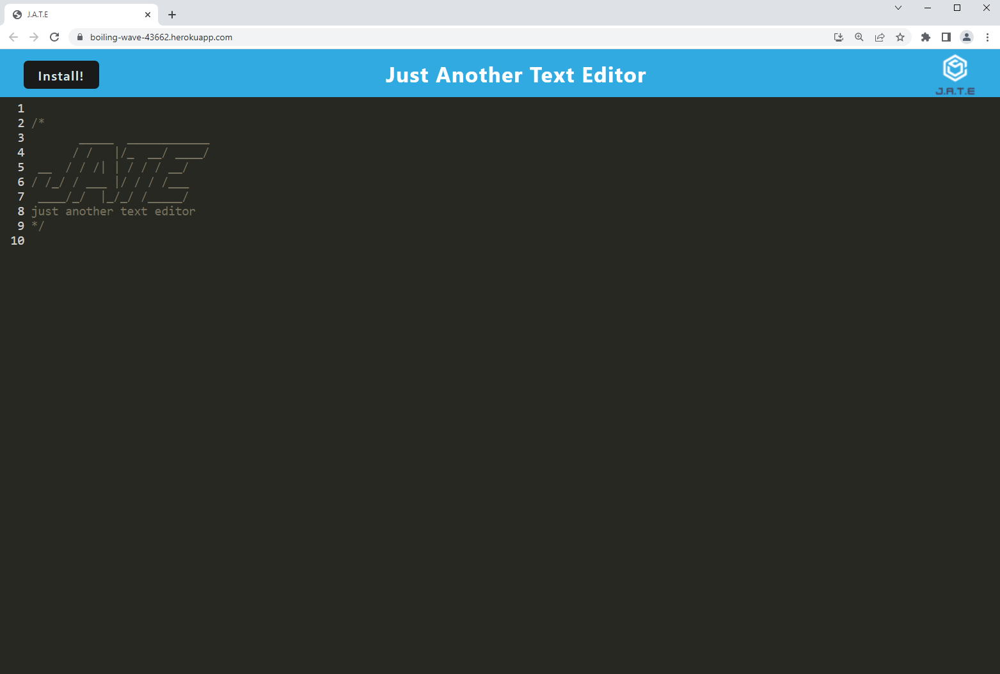

# Text Editor [](https://opensource.org/licenses/MIT)

## Description
<p> This application was created to enjoy the convenience having a place to take notes on and offline. The application uses PWA so it has the ability to be downloaded onto your computer. PWA's use the Service Worker and Cache APIs to cache assets and API responses, which ensures that the application will continue to work without an internet connection</p>

<p>This application was created with [Node.js](https://nodejs.org/en/). The modules used include:</p>

- [Express](https://expressjs.com/)

- [Webpack](https://webpack.js.org/)

- [webpack-dev-server](https://webpack.js.org/configuration/dev-server/)

- [WebpackPwaManifest](https://www.npmjs.com/package/webpack-pwa-manifest)

- [Babel](https://babeljs.io/)

- [CSS loaders](https://www.npmjs.com/package/css-loader)

- [Concurrently](https://www.npmjs.com/package/concurrently)

- [idb](https://www.npmjs.com/package/idb)

    
## Table of Contents 
- [Screenshots](#Screenshots)
- [Installation](#Installation)
- [Usage](#Usage)
- [License](#License)
- [Contribution](#Contribution)
- [Tests](#Tests)
- [Questions](#Questions)
- [Links](#Links)

## Screenshots

<p>Main Page</p>

- 

## Installation 
<p>To install this application please follow these instructions:</p>

- Please have node and npm installed.

- The application will be invoked by using the following command:

 ```
  git clone git@github.com:seanscott95/Text-Editor.git
 ```

- To start, make sure your are in the root repository and run ```npm run install``` to install the modules needed for this application.

- Then run ```npm start``` to start the application.

## Usage 
- Theres nothing technical about the usage at all. You type and the text editor does the rest. It'll save anything and everything you type in on and offline automatically.

## License 
<p> This application is covered under the:</p>

- [MIT-License](https://opensource.org/licenses/MIT)

## Contribution 
<p> None.</p>

## Tests 
<p> This application was not developed using Test Driven Development.</p>

## Questions 
<p> To reach me with additional questions please contact me via one of the following methods: </p>

- GitHub: [GitHub](https://github.com/seanscott95)
- Email: [Email](mailto:seanms418@gmail.com)
- LinkedIn: [LinkedIn](https://www.linkedin.com/in/sean-scott-18ba07225/)

## Links
- GitHub: [GitHub-Link](https://github.com/seanscott95/Text-Editor)
- Heroku: [Heroku-Link](https://boiling-wave-43662.herokuapp.com/)